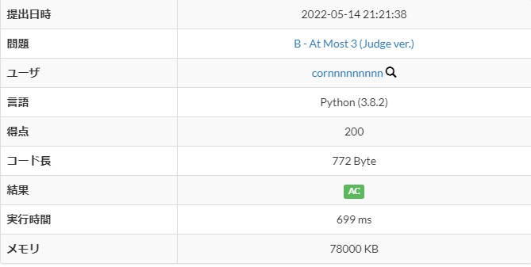
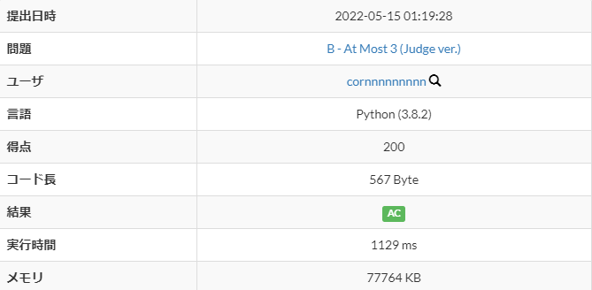
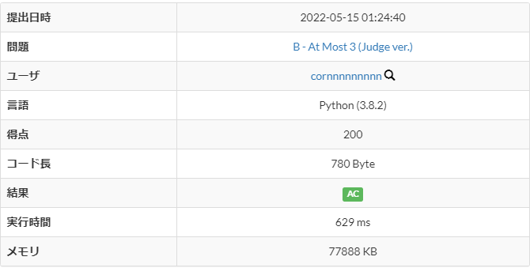
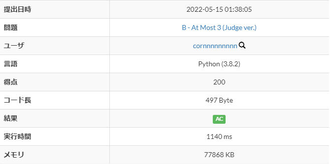
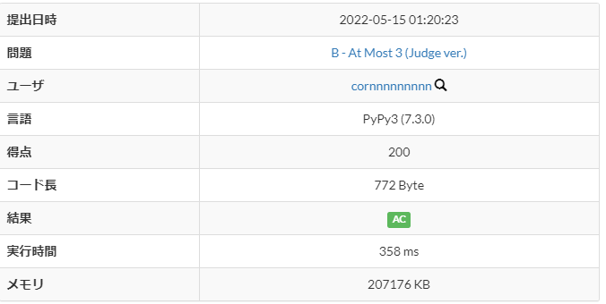
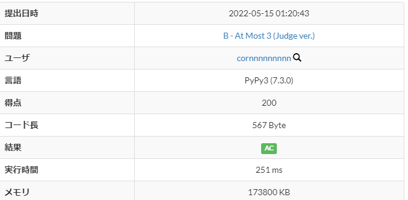
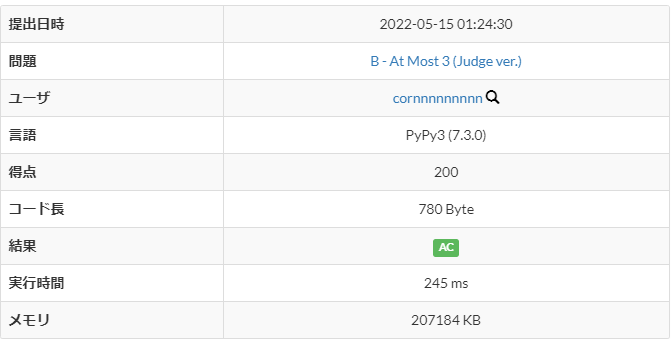
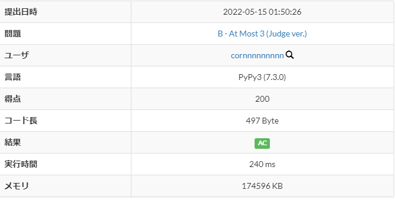

# [B - At Most 3 (Judge ver.)](https://atcoder.jp/contests/abc251/tasks/abc251_b)
[自分の回答はこちら](https://atcoder.jp/contests/abc251/submissions/me?f.Task=abc251_b&f.LanguageName=&f.Status=AC&f.User=)
---
## 要素
---
- main関数内に収めるか
  
- python or pypy
  
- input or readline  

## 結果
---
#### Python3.8.2
|        |main内|main外|
|:--     |:--:|:--:|
|readline| 699ms|1129ms|
|input   | 629ms|1140ms|

#### PyPy3
|        |main内|main外|
|:--     |:--:|:--:|
|readline| 358ms| 251ms|
|input   | 245ms| 240ms|

## 画像
---
- ### Python3.8.2 <!-- {style="list-style:none"} -->
    ---
    #### main関数ありとreadlineのpython (699ms)  
     

    #### main関数なしとreadlineのpython (1129ms)  
      

    #### main関数ありとinputのpython (629ms)
      

    #### main関数なしとinputのpython (1140ms)  
      
     
     
     

-  ### PyPy3
    ---
    #### main関数ありとreadlineのpypy (358ms)  
     

    #### main関数なしとreadlineのpypy (251ms)  
      

    #### main関数ありとinputのpypy (245ms)
      

    #### main関数なしとinputのpypy (240ms)  
      
     
     
